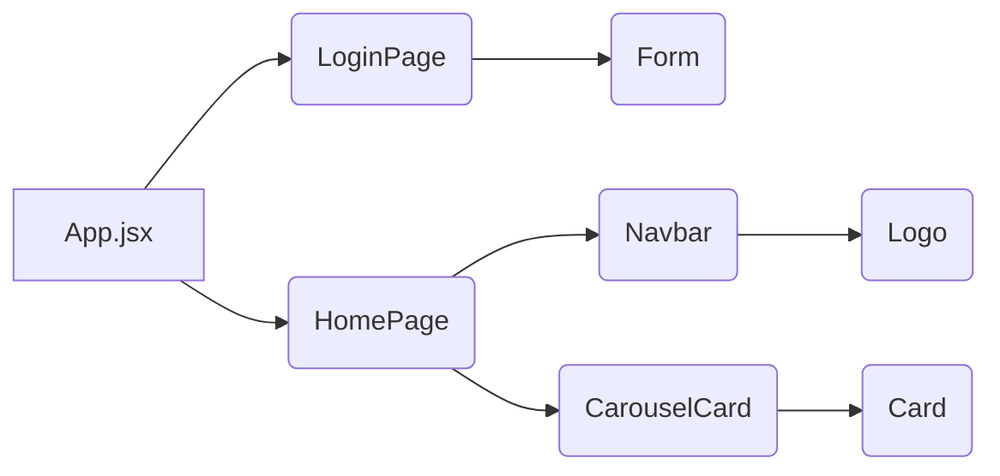
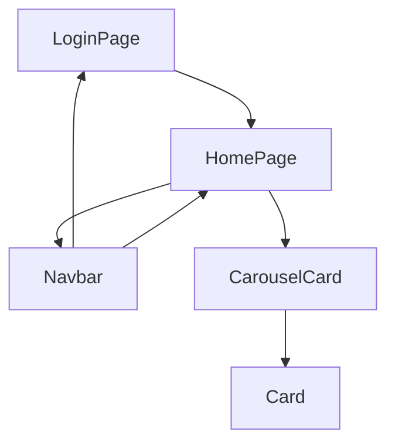

## App.jsx

### Introdução

`App.jsx` serve como o ponto de entrada principal da aplicação. Este arquivo define o componente `App`, que gerencia o estado de autenticação do usuário e determina qual página deve ser renderizada com base nesse estado.

### Uso

O componente `App` utiliza o hook `useState` para manter o estado de autenticação do usuário (`isLoggedIn`) e as informações do usuário atual (`currentUser`). O hook `useEffect` é usado para verificar se existe um usuário armazenado no local storage quando o componente é montado pela primeira vez.

### Código

```jsx
import { useEffect, useState } from "react";
import LoginPage from "./pages/login/LoginPage";
import HomePage from "./pages/home/HomePage";

function App() {
  // Estado para gerenciar se o usuário está logado
  const [isLoggedIn, setIsLoggedIn] = useState(false);
  // Estado para armazenar as informações do usuário atual
  const [, setCurrentUser] = useState(null);

  // Verifica se o usuário está autenticado ao carregar o componente
  useEffect(() => {
    // Recupera o usuário do local storage, se disponível
    const storedUser = JSON.parse(localStorage.getItem("currentUser") || "{}");
    // Se um token estiver presente, considera o usuário como logado
    setIsLoggedIn(!!storedUser.token);
    // Atualiza as informações do usuário atual com os dados recuperados
    setCurrentUser(storedUser);
  }, []);

  // Renderiza `HomePage` se o usuário estiver logado, caso contrário `LoginPage`
  return isLoggedIn ? <HomePage /> : <LoginPage />;
}

export default App;
```

### Detalhes Técnicos

- **useState**: Inicializa o estado de autenticação e o estado do usuário atual.
- **useEffect**: Executa uma verificação no local storage para determinar o estado de autenticação.
- **localStorage**: Utilizado para persistir as informações do usuário entre as sessões.
- **JSON.parse**: Converte a string armazenada no local storage de volta para um objeto JavaScript.
- **Operador Condicional (ternário)**: `isLoggedIn ? <HomePage /> : <LoginPage />` decide qual componente renderizar.

## LoginPage

### Introdução

O `LoginPage` é um componente React que gerencia a exibição da tela de login. Ele utiliza animações para melhorar a experiência do usuário e transições entre o estado inicial e o formulário de login.

### Código

```jsx
import { useState, useEffect } from "react";
import Logo from "../../components/Logo";
import Form from "../../components/Form";
import {
  Background,
  FormContainer,
  Wrapper,
  Overlay,
  StyledForm,
} from "../../styles/loginPage.styles";

const LoginPage = () => {
  const [showOverlay, setShowOverlay] = useState(true);

  useEffect(() => {
    const timer = setTimeout(() => {
      setShowOverlay(false);
    }, 2500);
    return () => clearTimeout(timer);
  }, []);

  return (
    <>
      {showOverlay && (
        <Overlay showOverlay={showOverlay}>
          <Logo />
        </Overlay>
      )}
      <FormContainer>
        <Wrapper>
          {!showOverlay && (
            <>
              <Logo />
              <StyledForm>
                <Form />
              </StyledForm>
            </>
          )}
        </Wrapper>
        <Background />
      </FormContainer>
    </>
  );
};

export default LoginPage;
```

### Detalhes Técnicos

- **useState**: Controla a visibilidade do overlay.
- **useEffect**: Gerencia um temporizador para a transição do overlay.
- **Overlay**: Um componente estilizado que exibe o logo durante a animação inicial.

## Form

### Introdução

O componente `Form` é responsável por gerenciar o estado do formulário de login e registro, incluindo a validação de entrada do usuário e a interação com o local storage para autenticação.

### Código

```jsx
import { useState } from "react";
import {
  Title,
  Paragraph,
  InputField,
  FormLabel,
  SubmitButton,
  RedSpan,
} from "../styles/Form.styles";

function generateToken() {
  return Math.random().toString(36).substring(2, 18);
}

const Form: React.FC = () => {
  const [username, setUsername] = useState("");
  const [password, setPassword] = useState("");
  const [formType, setFormType] = useState(0);
  const [, setLoggedIn] = useState(false);

  // Funções handleToggleForm, handleRegister, handleLogin aqui

  return (
    <form onSubmit={formType === 0 ? handleLogin : handleRegister}>
      {/* Elementos do formulário aqui */}
    </form>
  );
};

export default Form;
```

### Detalhes Técnicos

- **useState**: Mantém o estado dos campos de entrada e o tipo de formulário.
- **generateToken**: Gera um token aleatório para a autenticação do usuário.
- **handleToggleForm**: Alterna entre os modos de login e registro.
- **handleRegister**: Registra um novo usuário no local storage.
- **handleLogin**: Autentica um usuário existente.

## HomePage

### Introdução

O `HomePage` é um componente React que serve como a página inicial da aplicação. Ele combina vários componentes para criar uma interface de usuário rica e interativa.

### Código

```jsx
import React from "react";
import Navbar from "../../components/Navbar";
import CarouselCard from "../../components/Body";

const Home: React.FC = () => {
  return (
    <>
      <Navbar />
      <CarouselCard />
    </>
  );
};

export default Home;
```

### Detalhes Técnicos

- **Navbar**: Um componente que fornece a navegação principal da aplicação.
- **CarouselCard**: Um componente que exibe conteúdo em um formato de carrossel.

## Navbar

### Introdução

O componente `Navbar` é uma barra de navegação responsiva que permite aos usuários alternar entre diferentes categorias e realizar logout.

### Código

```jsx
import { FaBars as IconeCustomizado } from "react-icons/fa";
import { useState, useCallback, useEffect } from "react";
import {
  // Estilos importados aqui
} from "../styles/Navbar.styles";
import Logo from "./Logo";

// Componente Logout aqui

const Navbar = () => {
  // Estados e funções aqui

  return (
    // JSX do Navbar aqui
  );
};

export default Navbar;
```

### Detalhes Técnicos

- **useState**: Mantém o estado do menu e da categoria atual.
- **useCallback**: Otimiza as funções de toggle e logout para evitar recriações desnecessárias.
- **useEffect**: Recupera a categoria atual do local storage quando o componente é montado.
- **localStorage**: Armazena e recupera a categoria atual e os dados do usuário para funcionalidades de navegação e logout.

## CarouselCard

### Introdução

O componente `CarouselCard` é responsável por renderizar um carrossel de cards interativos que exibem informações sobre personagens, filmes ou HQs, dependendo da categoria selecionada pelo usuário.

### Código

```jsx
import { useState, useEffect } from "react";
import { FaStar, FaTimes } from "react-icons/fa";
// Importações de estilos omitidas para brevidade

interface CardInfo {
  // Estrutura da interface CardInfo aqui
}

const CarouselCard = () => {
  // Estados e efeitos para gerenciar a lista de cards e a categoria atual

  // Função para filtrar filmes por cronologia ou ano de lançamento

  return (
    // JSX do CarouselCard aqui
  );
};

// Componente Card individual

const Card = ({
  item,
  categoriaAtual,
}: {
  item: CardInfo;
  categoriaAtual: string;
}): JSX.Element => {
  // Estado e função para controlar a expansão do card

  return (
    // JSX do Card aqui
  );
};

export default CarouselCard;
```

### Detalhes Técnicos

- **useState**: Utilizado para manter o estado da lista de cards, a lista completa para filtragem e a categoria atual.
- **useEffect**: Empregado para carregar a categoria atual do localStorage e para carregar os dados do JSON quando a categoria muda.
- **fetch**: Usado para solicitar dados do arquivo JSON.
- **Filtragem**: A função `filtrarFilmes` permite ordenar a lista de filmes por cronologia ou ano de lançamento.

## Card

### Introdução

O componente `Card` é um card individual dentro do carrossel que pode ser expandido para mostrar mais detalhes sobre o item exibido.

### Código

```jsx
// Componente Card individual com estados e funções

export default Card;
```

### Detalhes Técnicos

- **useState**: Controla se o card está expandido ou não.
- **toggleExpand**: Função que alterna o estado de expansão do card.
- **Ícones**: `FaStar` e `FaTimes` do `react-icons/fa` são usados para representar avaliações e fechar o card expandido.

---

## Diagrama de Arquitetura Geral do Aplicativo:


### Diagrama de Fluxo de Navegação:


### Diagrama do Processo de Autenticação:
```mermaid
graph TD;
    A[App.jsx] --> B(LoginPage);
    B --> C(Form);
    C --> D(handleLogin);
    C --> E(handleRegister);
    D --> F(localStorage);
    E --> F(localStorage);
